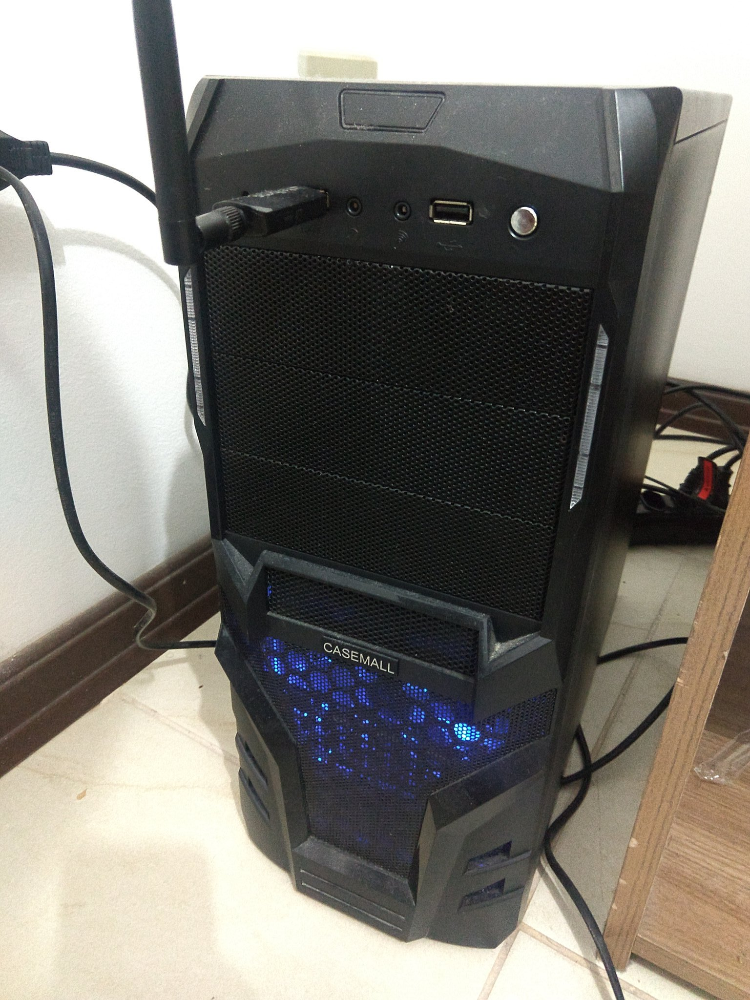

TOP500 & me: Comparativo de Arquiteturas Paralelas
--------------------------------------------------

Nome: Jairo Ferreira Gez

| Característica                                            | Computador no TOP500  | Meu computador  |
| --------------------------------------------------------- | --------------------- | --------------- |
| Nome/Título                                               |    Summit                   |      Meu desktop           |
| Imagem (foto, diagrama, screenshot, etc.)                 |  |  |
| Classificação de Flynn                                    |MIMD                   |MISD             |
| Memória: compartilhada, distribuída ou ambas?             |Ambas                  |Compartilhada    |
| Número total de núcleos de processamento                  |2.397.824 Núcleos      |4 Núcleos e 4 Threads|
| Fabricante e modelo do(s) processador(es)                 |IBM POWER9 22C         |Intel Core i5-3300|
| Frequência do(s) processador(es)                          |3,07GHz                |3,00GHz          |
| Memória total                                             |2.801.664 GB           |8GB              |
| Tipo(s) de interconexão entre os núcleos/processadores    |Dual-rail Mellanox EDR Infiniband|Quickpath Interconnect|
| Desempenho Linpack                                        |143.500 TFlop/s        |70,0633 GFlop/s (Linpack Xtreme Benchmark v1.1.2) |

### Referências
- Intel® Core™ i5-3330 Processor https://ark.intel.com/content/www/us/en/ark/products/65509/intel-core-i5-3330-processor-6m-cache-up-to-3-20-ghz.html.
- Summit - IBM Power System AC922 Overview: https://www.top500.org/system/179397.
- Link para download do benchmark: https://www.techpowerup.com/download/linpack-xtreme/.
- Antonio Carlos Melo do Amaral. Quais são as diferenças entre um FSB e DMI Bus. http://ptcomputador.com/Ferragens/ram-cards-motherboards/56478.html.
